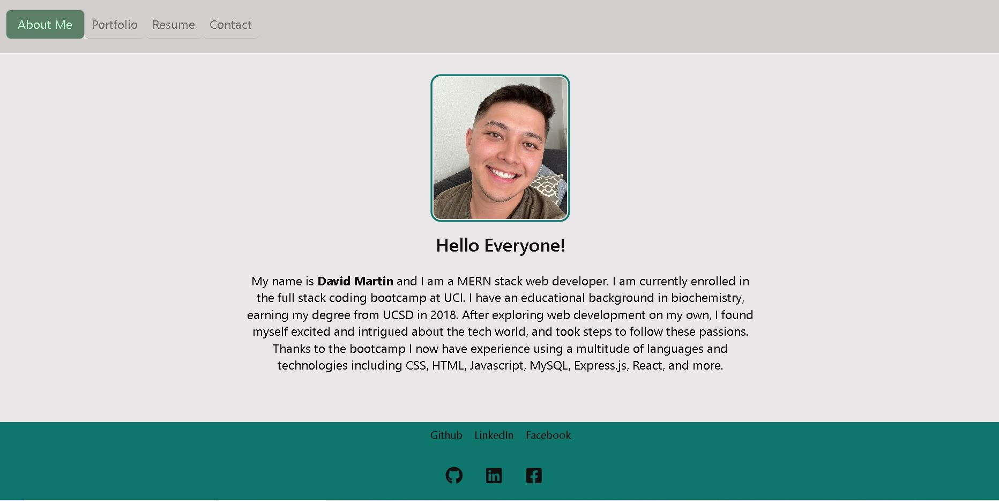

# 20 React: React Portfolio

## Description
 
This application is a personal description of myself and portfolio of some of the projects I have worked on throughout the coding bootcamp. I built this site using some of the latest technologies and React. On the site, the user can see a short paragraph about me, my portfolio of projects, my resume, and a contact form. The user can switch between pages using the header navigation. 

## User Story

```md
AS AN employer looking for candidates with experience building single-page applications
I WANT to view a potential employee's deployed React portfolio of work samples
SO THAT I can assess whether they're a good candidate for an open position
```

## Installation

N/A

## Usage

Follow the link to my website and easily navigate through the pages to find my portfolio and short bio. 

## Mock-Up

The following animation shows the web application's appearance and functionality:




## Links

My Github: https://github.com/David8127

Deployed App: https://inspiring-duckanoo-0b29e3.netlify.app/